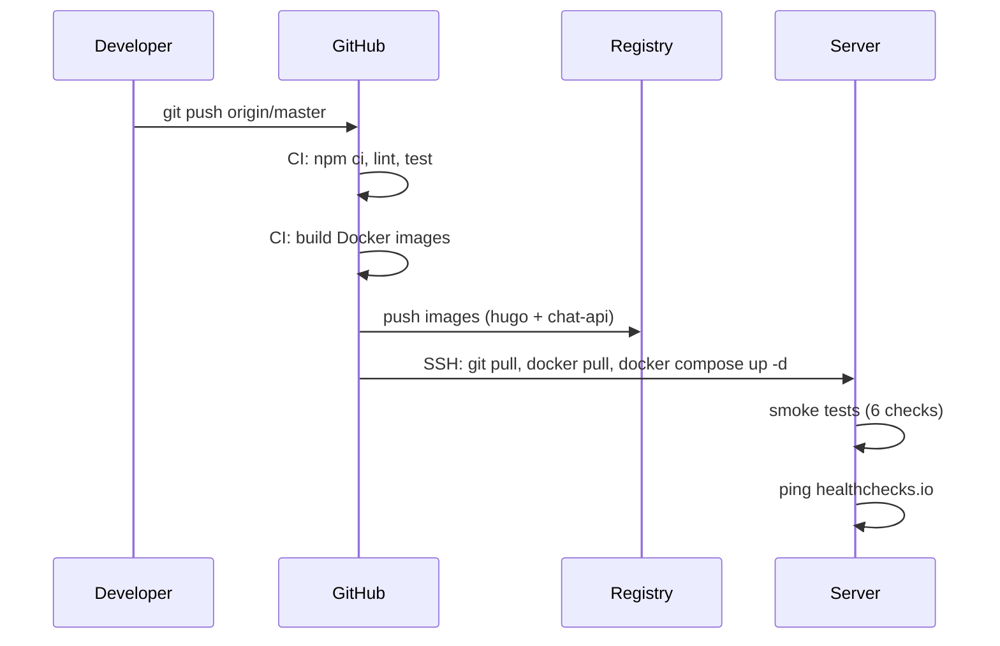

# Deployment

## Prerequisites

- Docker 24+ with docker compose plugin
- Traefik reverse proxy running with a Docker network called `traefik-public`
- A private Docker registry (default: `registry.chemie-lernen.org`)
- LiteLLM proxy running on network `litellm-compose_litellm-internal`
- Two Neo4j 5 databases (included in compose):
  - `chemie-neo4j` — shared central knowledge graph (chemie + code-analysis + modulhandbuch subsets)
  - `chemie-kg` — dedicated chemistry-only instance (Entity, Document, Tag, Content labels)

## Quick Start

```bash
# Clone
git clone https://github.com/your-org/hugo-chemie-lernen-org.git
cd hugo-chemie-lernen-org

# Create .env from template
cp .env.example .env
# Edit .env with real values (see Configuration below)

# Start all services
docker compose up -d

# Check health
curl https://chemie-lernen.org/api/health
# -> {"status":"ok","neo4j":"connected","litellm":"connected"}
```

## Architecture

### Services

| Service                | Container      | Port      | Description                           |
| ---------------------- | -------------- | --------- | ------------------------------------- |
| hugo-chemie-lernen-org | nginx          | 80        | Static Hugo site (behind Traefik)     |
| chemie-chat-api        | Node.js        | 3001      | Express 4 API server                  |
| chemie-neo4j           | Neo4j 5.26     | 7687      | Central knowledge graph (all subsets) |
| chemie-kg              | Neo4j 5.26     | 7687      | Chemistry-only knowledge graph        |
| prometheus             | Prometheus     | 9090      | Metrics store (30d retention)         |
| grafana                | Grafana        | 3000      | Dashboards + alerting                 |
| node_exporter          | Prometheus     | host:9100 | Host metrics (CPU, disk, memory)      |
| cadvisor               | cadvisor       | 8080      | Container metrics                     |
| neo4j-exporter         | Neo4j exporter | 9399      | Neo4j query latency, heap, conns      |

### Networks

| Network            | Type     | Purpose                                               |
| ------------------ | -------- | ----------------------------------------------------- |
| `traefik-public`   | external | Traefik reverse proxy                                 |
| `traefik-web`      | bridge   | Internal container-to-container                       |
| `litellm-internal` | external | LLM proxy access (`litellm-compose_litellm-internal`) |

### Volumes

| Volume              | Mount              | Purpose                             |
| ------------------- | ------------------ | ----------------------------------- |
| `chemie_neo4j_data` | `/data`            | Central Neo4j database files        |
| `chemie_neo4j_logs` | `/logs`            | Central Neo4j debug.log             |
| `chemie_kg_data`    | `/data`            | Chemistry-only Neo4j database files |
| `chemie_kg_logs`    | `/logs`            | Chemistry-only Neo4j debug.log      |
| `prometheus_data`   | `/prometheus`      | Prometheus TSDB (30d retention)     |
| `grafana_data`      | `/var/lib/grafana` | Grafana state, dashboards           |

### Deployment Flow



## Configuration

All configuration is loaded from `.env` (gitignored). Copy `.env.example` to get started.

### Required

| Variable         | Description                   | Default                           |
| ---------------- | ----------------------------- | --------------------------------- |
| `NEO4J_PASSWORD` | Neo4j authentication password | `change_me_32_char_random_string` |
| `JWT_SECRET`     | Secret for signing JWT tokens | `change_me_64_hex_chars_...`      |
| `LITELLM_URL`    | LiteLLM proxy URL             | `http://litellm-proxy:4000`       |
| `LITELLM_MODEL`  | LLM model name                | `gemma-4`                         |

### SMTP (Password Reset)

| Variable        | Description                    | Default                     |
| --------------- | ------------------------------ | --------------------------- |
| `SMTP_HOST`     | SMTP server                    | `mail.tobias-weiss.org`     |
| `SMTP_PORT`     | SMTP port                      | `587`                       |
| `SMTP_USER`     | SMTP username                  | `chemie@tobias-weiss.org`   |
| `SMTP_PASSWORD` | SMTP password                  | —                           |
| `EMAIL_FROM`    | From address for outgoing mail | `support@chemie-lernen.org` |

### Stripe (Premium)

| Variable                | Description                      |
| ----------------------- | -------------------------------- |
| `STRIPE_SECRET_KEY`     | Stripe API secret                |
| `STRIPE_WEBHOOK_SECRET` | Stripe webhook signing secret    |
| `STRIPE_PRICE_ID`       | Stripe price ID for premium tier |

### Monitoring

| Variable                 | Description                          |
| ------------------------ | ------------------------------------ |
| `SENTRY_DSN`             | Sentry error tracking DSN            |
| `HEALTHCHECKS_IO_URL`    | Uptime ping URL from healthchecks.io |
| `GRAFANA_ADMIN_PASSWORD` | Grafana admin password               |

### Off-site Backup (Restic)

| Variable            | Description                              |
| ------------------- | ---------------------------------------- |
| `RESTIC_REPOSITORY` | Restic repository URL (e.g. s3:https://) |
| `RESTIC_PASSWORD`   | Restic repository encryption password    |

### Hugo

| Variable      | Description         |
| ------------- | ------------------- |
| `HUGO_DOMAIN` | Domain for the site |

## Building

```bash
# Build chat API image (from ./api/)
docker build -t registry.chemie-lernen.org/chemie-chat-api:latest api/

# Build Hugo site image (from project root Dockerfile)
docker compose build hugo-chemie-lernen-org

# Push to private registry
docker push registry.chemie-lernen.org/chemie-chat-api:latest
docker push registry.chemie-lernen.org/chemie-lernen-org:latest
```

On CI (push to master), GitHub Actions builds both images, tags them with `latest` and the short commit SHA, pushes to the registry, then SSHes into the server to pull and restart.

## Backups

### Automated (recommended)

A nightly restic backup job runs via systemd timer. It covers:

- **Neo4j data** (both `chemie-neo4j` and `chemie-kg`) — exported via `neo4j-admin database dump`
- **Auth DB** (`api/auth-db.js` JSON file)
- **KG exports** (`myhugoapp/data/kg_data.json`)

Backups are encrypted and pushed to Backblaze B2 (or configured `RESTIC_REPOSITORY`). See `/etc/restic/` or the systemd timer on the server.

### Manual backup scripts

Scripts in `scripts/` for manual use:

```bash
# Master backup (all Neo4j instances)
./scripts/backup-all.sh

# Individual Neo4j instance backup
./scripts/backup-chemie-neo4j.sh     # central KG
./scripts/backup-chemie-kg.sh        # chemistry-only KG

# Off-site restic push of local backups
node scripts/backup-db.js
```

### Docker volume backup

```bash
docker run --rm -v chemie_neo4j_data:/data -v $(pwd):/backup alpine \
  tar czf /backup/neo4j-$(date +%Y%m%d).tar.gz -C /data .
```

### Restore

```bash
# Restore Neo4j database from dump
./scripts/restore-neo4j.sh \
  --container chemie-kg \
  --database chemie \
  --dump /path/to/backup.dump \
  --confirm
```

## CI/CD Pipeline

The deploy workflow (`.github/workflows/deploy.yml`) runs on every push to `master`:

1. **test job** (ubuntu-latest): `npm ci` -> audit (critical only) -> lint -> unit tests
2. **build-and-deploy job** (self-hosted, `legion` runner):
   - Export KG data from Neo4j (`node scripts/export-kg-data.mjs`)
   - Generate entity pages (`node scripts/generate-entity-pages.mjs`)
   - Build + push Hugo image and Chat API image to private registry
   - SSH into production server: git pull, docker pull, `docker compose up -d`
   - Smoke tests (6 checks: entity page, JS loading, health endpoint, KG stats, chat validation)
   - Ping healthchecks.io
   - Prune old Docker images

## Monitoring

### Observability Stack

| Service         | URL                                  | Purpose                               |
| --------------- | ------------------------------------ | ------------------------------------- |
| Prometheus      | `prometheus.chemie-lernen.org`       | Metrics store, scrapes all targets    |
| Grafana         | `grafana.chemie-lernen.org`          | Dashboards (provisioned) + alerting   |
| Sentry          | (configured via SENTRY_DSN)          | Error tracking for chat API           |
| healthchecks.io | (configured via HEALTHCHECKS_IO_URL) | Uptime monitoring for deploy + backup |

### Scrape Targets

- `node_exporter` — host-level CPU, memory, disk, network
- `cadvisor` — per-container CPU, memory, filesystem
- `neo4j-exporter` — Neo4j query latency, heap usage, active connections
- `chemie-chat-api` — Express metrics (request rate, latency, errors) via `express-prom-bundle`

## Hardening

| Measure                        | Details                                                                                   |
| ------------------------------ | ----------------------------------------------------------------------------------------- |
| **Secrets in `.env`**          | All secrets (JWT, Neo4j passwords, Stripe keys, SMTP credentials) loaded from `.env` file |
| **Rate limiting**              | `express-rate-limit` on `/api/chat` (20 req/min) and `/api/auth/*` (10 req/min)           |
| **Off-site backup via restic** | Nightly encrypted backups to Backblaze B2                                                 |
| **Traefik TLS**                | Automatic Let's Encrypt certificate management via `mytlschallenge` certresolver          |
| **Resource limits**            | Memory limits set per container (128M for API, 1G for Neo4j, 256M for Hugo)               |

## Troubleshooting

### Check service health

```bash
docker compose ps
docker compose logs chemie-chat-api
curl https://chemie-lernen.org/api/health
```

### API not responding

```bash
# Check Traefik routing
docker compose logs traefik | grep chat

# Check API startup logs
docker compose logs chemie-chat-api

# Verify LiteLLM proxy is reachable
docker exec chemie-chat-api wget -qO- http://litellm-proxy:4000/health
```

### Neo4j connection issues

```bash
# Check if Neo4j is accepting connections
docker exec chemie-kg cypher-shell -u neo4j -p $NEO4J_PASSWORD "RETURN 1"

# Check Neo4j logs
docker compose logs chemie-kg

# Verify API can resolve the Neo4j hostname
docker exec chemie-chat-api getent hosts chemie-kg
```

### Rolling back

```bash
# Revert to previous Docker image
docker pull registry.chemie-lernen.org/chemie-chat-api:previous-tag
docker compose up -d chemie-chat-api

# Or revert git + rebuild
git revert HEAD
docker compose build
docker compose up -d
```
