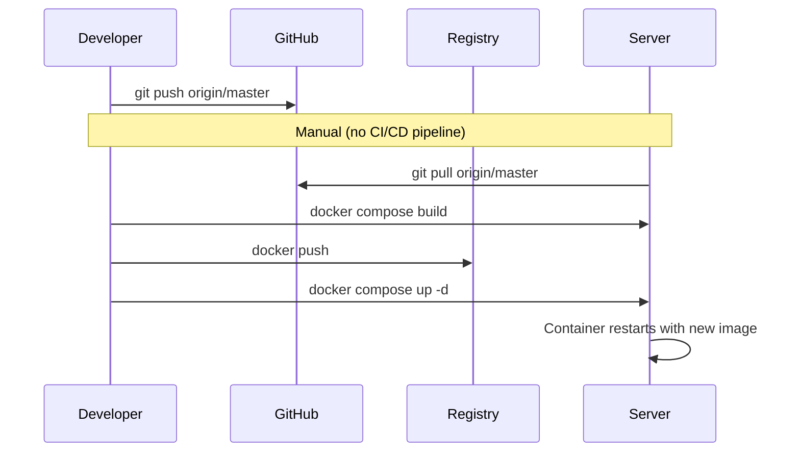

# Deployment

## Prerequisites

- Docker 24+ with docker-compose plugin
- Traefik reverse proxy running with a Docker network called `traefik-public`
- LiteLLM proxy running on network `litellm-compose_litellm-internal`
- A Neo4j 5 database (optional — compose file includes one)
- A registry to push images (the default is `registry.chemie-lernen.org`)

## Quick Start

```bash
# Clone
git clone https://github.com/your-org/hugo-chemie-lernen-org.git
cd hugo-chemie-lernen-org

# Start all services
docker compose up -d

# Check health
curl https://chemie-lernen.org/api/health
# → {"status":"ok","neo4j":"connected","litellm":"connected"}
```

## Services

| Service                | Container | Port | Description                  |
| ---------------------- | --------- | ---- | ---------------------------- |
| hugo-chemie-lernen-org | nginx     | 80   | Static site (behind Traefik) |
| chemie-chat-api        | Node.js   | 3001 | Express API server           |
| chemie-kg              | Node.js   | 7687 | KG proxy/graphql             |
| chemie-neo4j           | Neo4j 5   | 7687 | Graph database               |
| chemie-logs            | nginx     | 9090 | Log dashboard                |

## Environment Variables

Set these via `docker-compose.yml` `environment:` or an `.env` file.

### Required

| Variable         | Description                   | Default                             |
| ---------------- | ----------------------------- | ----------------------------------- |
| `JWT_SECRET`     | Secret for signing JWT tokens | _(none — startup fails if missing)_ |
| `NEO4J_URI`      | Neo4j connection string       | `bolt://chemie-kg:7687`             |
| `NEO4J_USER`     | Neo4j username                | `neo4j`                             |
| `NEO4J_PASSWORD` | Neo4j password                | _(set in compose)_                  |
| `LITELLM_URL`    | LiteLLM proxy URL             | `http://litellm-proxy:4000`         |
| `LITELLM_MODEL`  | LLM model name                | `gemma-4`                           |
| `PORT`           | API server port               | `3001`                              |

### Optional (Stripe)

| Variable                | Description                      |
| ----------------------- | -------------------------------- |
| `STRIPE_SECRET_KEY`     | Stripe API secret                |
| `STRIPE_WEBHOOK_SECRET` | Stripe webhook signing secret    |
| `STRIPE_PRICE_ID`       | Stripe price ID for premium tier |

### Optional (Monitoring)

| Variable              | Description                          |
| --------------------- | ------------------------------------ |
| `SENTRY_DSN`          | Sentry error tracking DSN            |
| `HEALTHCHECKS_IO_URL` | Uptime ping URL from healthchecks.io |

## Building

```bash
# Build chat API image
docker build -t registry.chemie-lernen.org/chemie-chat-api:latest api/

# Push to registry
docker push registry.chemie-lernen.org/chemie-chat-api:latest

# Build Hugo site image
docker compose build hugo-chemie-lernen-org
```

## Volumes

| Volume              | Mount       | Purpose                 |
| ------------------- | ----------- | ----------------------- |
| `chemie_neo4j_data` | `/data`     | Neo4j database files    |
| `chemie_neo4j_logs` | `/logs`     | Neo4j debug.log         |
| `chemie_kg_data`    | KG app data | Knowledge graph exports |

## Networks

| Network            | Type     | Purpose                |
| ------------------ | -------- | ---------------------- |
| `traefik-public`   | external | Traefik reverse proxy  |
| `traefik-web`      | bridge   | Internal web traffic   |
| `litellm-internal` | external | LLM proxy access       |
| Default            | bridge   | Container-to-container |

## Deployment Flow



## Hardening (2026-07)

The following security hardening measures are in place:

| Measure                        | Details                                                                                                                                                          |
| ------------------------------ | ---------------------------------------------------------------------------------------------------------------------------------------------------------------- |
| **Secrets in `.env`**          | JWT_SECRET, NEO4J_PASSWORD, STRIPE_SECRET_KEY, STRIPE_WEBHOOK_SECRET, LITELLM_API_KEY, SENTRY_DSN, HEALTHCHECKS_IO_URL all loaded from `.env` — never hardcoded. |
| **Rate limiting active**       | `express-rate-limit` is applied on `/api/chat` (20 req/min) and `/api/auth/*` (10 req/min) to prevent abuse. Configured in `api/auth.js` and `api/server.js`.    |
| **Off-site backup via restic** | Nightly restic job backs up Neo4j data, auth-db, and KG exports to Backblaze B2. See `/etc/restic/` or the systemd timer `restic-backup.timer`.                  |

### Replacing the deprecated `neo4j-backup.sh`

The old `scripts/neo4j-backup.sh` used Neo4j 4.x `neo4j-admin dump` syntax that is **incompatible with Neo4j 5.x**. It has been removed. Use one of the following instead:

- **Docker volume backup** (simple):

  ```bash
  docker run --rm -v chemie_neo4j_data:/data -v $(pwd):/backup alpine \
    tar czf /backup/neo4j-$(date +%Y%m%d).tar.gz -C /data .
  ```

- **Restic / automated** (recommended): The restic job runs nightly via systemd timer and handles retention + off-site sync automatically.

## Backup & Restore

### Neo4j Database

```bash
# Backup via volume (safe — Neo4j 5.x supports hot backups)
docker run --rm -v chemie_neo4j_data:/data -v $(pwd):/backup alpine \
  tar czf /backup/neo4j-$(date +%Y%m%d).tar.gz -C /data .

# Restore
docker stop chemie-neo4j
docker run --rm -v chemie_neo4j_data:/data -v $(pwd):/backup alpine \
  tar xzf /backup/neo4j-YYYYMMDD.tar.gz -C /data
docker start chemie-neo4j
```

### User Data (auth-db)

User data is stored in `api/auth-db.js` as a JSON file. Back up the mounted volume or copy the file manually. The nightly restic backup covers this automatically.

## Rolling Back

```bash
# Revert to previous Docker image
docker pull registry.chemie-lernen.org/chemie-chat-api:previous-tag
docker compose up -d chemie-chat-api

# Or revert git + rebuild
git revert HEAD
docker build -t registry.chemie-lernen.org/chemie-chat-api:latest api/
docker push ...
docker compose up -d chemie-chat-api
```
