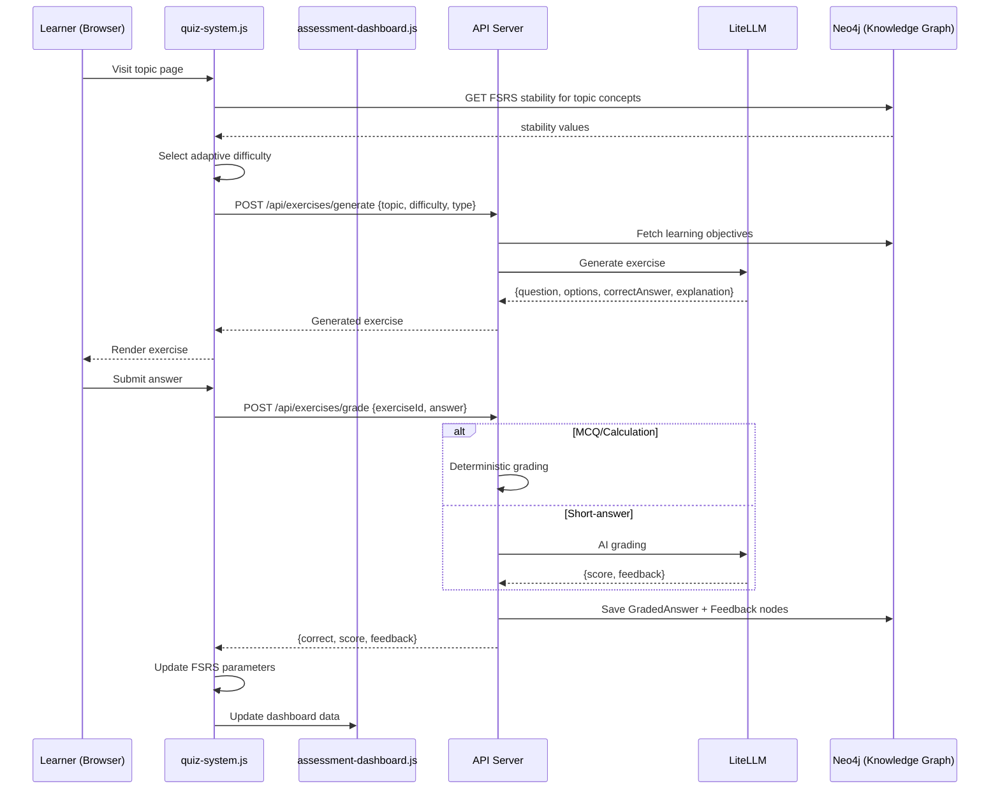

## Context

The platform already has:

- **Quiz system** (`quiz-system.js`, `quiz-user-system.js`, `spaced-repetition.js`) — hand-authored quizzes with FSRS scheduling, progress tracking in localStorage, and gamification engine
- **Exercise generator** (`api/routes/exercises.js`) — LiteLLM-based generation from KG learning objectives, with `/api/exercises/generate` and `/api/exercises/answer` endpoints
- **Knowledge graph** (Neo4j) — stores `LearningObjective`, `Topic`, `Curriculum` nodes with full-text indexes
- **Quiz history/dashboard** — `saveQuizHistory()` in localStorage, `POST /api/quiz-results`, dashboard with recent/streak/weak-area views
- **i18n** (`de.json`) — existing quiz/calculator namespaces

The gap: generation is detached from adaptation. Exercises are generated once but never tied to a student's FSRS state. Grading exists for MCQ/calc but not for short-answer. Feedback is static ("correct" / "incorrect" + canned explanation). Teachers have no aggregated view of student performance.

This design connects AI generation → auto-grading → individualized feedback → dashboard into a coherent pipeline, reusing existing infrastructure where possible.

## Goals / Non-Goals

**Goals:**

- AI-powered exercise generation from KG learning objectives (MCQ, fill-in-blank, calculation, short-answer)
- Auto-grading: deterministic for MCQ/calc, AI-assisted for short-answer/free-text
- Individualized feedback: each answer gets a personalized explanation referencing the learner's FSRS state and past mistakes
- Adaptive difficulty: quiz engine selects difficulty based on FSRS stability metrics
- Assessment dashboard: teacher view (class-level) and learner view (personal progress, weak areas)
- Persistence: graded answers, feedback, and teacher annotations stored in Neo4j

**Non-Goals:**

- Real-time collaborative assessments (multi-user simultaneous quizzes)
- Plagiarism detection
- Handwriting recognition for chemical formulas
- Video-based assessment
- External LMS integration (Moodle/ILIAS import/export)

## Decisions

### Decision 1: AI generation via existing LiteLLM endpoint — extend, don't replace

**Chosen:** Extend `api/routes/exercises.js` with new generation modes (short-answer) and feedback endpoint
**Alternatives considered:**

- **Separate AI microservice**: Overkill for current scale — LiteLLM is already integrated
- **Direct LLM API calls**: Lose LiteLLM's model abstraction and load balancing

**Rationale:** The `/api/exercises/generate` endpoint already handles MCQ and calculation generation. Adding short-answer generation and a new `/api/exercises/feedback` endpoint reuses authentication, rate-limiting, and error-handling middleware.

### Decision 2: Feedback generated per-answer, not per-session

**Chosen:** Call LLM for feedback on each answer submission (with caching for identical question/answer pairs)
**Alternatives considered:**

- **Batch feedback**: Generates feedback for a whole quiz at once — loses specificity on individual mistakes
- **Template-based feedback**: Reusable templates (e.g., "You confused X with Y") — less personalized but cheaper

**Rationale:** Students need immediate, specific feedback on each answer to learn effectively. Cache identical (question, answer, student_level) triplets to avoid redundant LLM calls. Cost is manageable: ~100-200 tokens per feedback call, ~2000 active students/day → ~$0.30-0.60/day at GPT-4o-mini pricing.

### Decision 3: Neo4j for assessment persistence, not PostgreSQL

**Chosen:** Store `Assessment`, `GradedAnswer`, `Feedback` nodes in the existing Neo4j `chemie` database
**Alternatives considered:**

- **PostgreSQL (separate DB)**: Adds operational complexity — need to manage another DB instance
- **Flat files (JSON)**: Not queryable for teacher dashboards across students
- **localStorage only**: Loses cross-session and cross-device data

**Rationale:** Neo4j is already deployed and backed up. Assessment data is inherently graph-shaped: `(Student)-[:COMPLETED]->(Assessment)-[:TESTS]->(LearningObjective)` and `(GradedAnswer)-[:RECEIVED]->(Feedback)-[:REFERENCES]->(Concept)`. The existing `_neo4j-subset-filter.mjs` can be extended with an `Assessment` label filter.

### Decision 4: Adaptive difficulty via FSRS stability, not separate model

**Chosen:** Use `stability` (FSRS-derived) as the primary difficulty signal — map `stability` ranges to quiz difficulties
**Alternatives considered:**

- **Separate ML model**: Overengineered for the problem — FSRS already tracks how well a student knows each concept
- **Simple performance average**: Loses recency and spacing effects

**Rationale:** FSRS `stability` (in days) directly measures how well a concept is retained. Mapping: stability < 7d → easy, 7-30d → medium, > 30d → hard. If no FSRS data exists for a topic, start at the student's global average or default to "leicht".

**Data flow:**

```
Learner visits topic page
  → quiz checks FSRS stability for that topic's concepts
  → selects difficulty level based on stability ranges
  → generates questions at that difficulty via /api/exercises/generate
  → learner submits answers
  → auto-grader scores (deterministic or AI)
  → feedback engine generates personalized explanation
  → results saved to Neo4j + localStorage (for offline resilience)
  → FSRS parameters updated for spaced repetition
  → Dashboard updated
```

### Decision 5: Teacher dashboard via API + static page with client-side data fetch

**Chosen:** Teacher dashboard is a Hugo static page that fetches assessment data via `/api/assessment/results` (JSON)
**Alternatives considered:**

- **Server-rendered dashboard**: Breaks the Hugo static-site model — would need SSR or client-side JS anyway
- **Dedicated dashboard SPA**: Overkill for the current feature set — a single-page layout with chart.js is sufficient

**Rationale:** The existing "dashboard.md" page pattern (static Hugo page + client-side JS fetching API data) works well for the learner quiz dashboard and is familiar to the codebase.

## Risks / Trade-offs

| Risk                                                                                               | Mitigation                                                                                                                                                                       |
| -------------------------------------------------------------------------------------------------- | -------------------------------------------------------------------------------------------------------------------------------------------------------------------------------- |
| **LLM cost explosion** with many students                                                          | Token budget per user/day enforced in middleware. Cache identical feedback triplets. Use cheaper model (GPT-4o-mini) for generation/feedback, reserve GPT-4o for complex grading |
| **LLM hallucination in feedback** — AI generates incorrect chemistry                               | Feedback includes disclaimer "KI-generiert — bitte mit Lehrenden besprechen". All feedback stored in Neo4j for audit. Teacher can flag/override feedback via dashboard           |
| **Neo4j query performance** — 2000 students × 10 assessments/day = 20k new nodes/day (~600k/month) | Label-only queries scoped by subset filter. Index on `Assessment.userId` and `GradedAnswer.createdAt`. Archive assessments older than 1 year to cold storage                     |
| **Latency** — LLM calls add 1-3s to answer submission                                              | Show "Wird bewertet..." spinner with optimistic UI. MCQ/calc graded instantly (deterministic), only short-answer waits for LLM                                                   |
| **Data privacy** — student answers stored in Neo4j                                                 | All assessment nodes are pseudonymous (user ID, no PII). 1-year retention policy. GDPR-compliant deletion endpoint                                                               |
| **Rate limiting** — student spamming the generate endpoint                                         | Enforce 10 generations/hour per user. Cache generated exercises per learning objective + difficulty combo                                                                        |

## Architecture Overview



## Data Schema (Neo4j)

```
(:Assessment {
  id: string,          // UUID
  userId: string,      // pseudonymous user ID
  type: string,        // "auto-generated" | "teacher-assigned"
  topic: string,       // topic slug
  difficulty: string,  // leicht | mittel | schwer
  createdAt: datetime
})-[:TESTS]->(:LearningObjective {slug: string})

(:GradedAnswer {
  id: string,
  exerciseId: string,
  userId: string,
  answer: string,
  correct: boolean,
  score: number,       // 0-100
  gradedBy: string,    // "deterministic" | "ai"
  createdAt: datetime
})-[:PART_OF]->(:Assessment)
-[:ANSWERS]->(:Exercise {id: string})

(:Feedback {
  id: string,
  text: string,        // personalized feedback text
  aiGenerated: boolean,
  teacherOverride: boolean,
  teacherNote: string,  // optional teacher annotation
  createdAt: datetime
})-[:FOR]->(:GradedAnswer)
-[:REFERENCES]->(:Concept {slug: string})
-[:REFERENCES]->(:LearningObjective {slug: string})
```

## Open Questions

1. **Teacher assignment workflow**: Should teachers be able to manually select which learning objectives to include in a generated assessment? Or should it be fully automated based on the curriculum?
2. **Feedback language**: Always German or configurable per user? (Current user base is exclusively German)
3. **Anonymous access**: Non-logged-in users can take quizzes now — should anonymous assessments be persisted (ephemeral user ID) or not saved at all?
